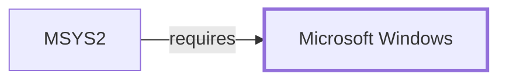

# Windows Security Boundary

> **Contextual scope.** This page documents the *boundary* between MSYS2 and
> a Windows subsystem — what MSYS2 depends on, where this knowledge base's
> claims stop, and what evidence an exact claim would need. It is not a
> Windows internals reference. See
> [ADR 0001](../charter/adr/0001-windows-platform-contextual-scope.md).

## Purpose

Windows access control, tokens, integrity levels, code signing, and
credential stores form the host security context every MSYS2 program runs
inside. Package signing is a *separate* control, and keeping them separate
is this page's main job.

## What MSYS2 depends on

ACLs and tokens for file and process access; the platform's code-signing
verification where it applies; and credential stores where a program chooses
to use one — as the
[Git for Windows credential manager](GIT-FOR-WINDOWS-CREDENTIAL-MANAGER.md)
does.

## Where the boundary sits

Two verification systems exist and answer different questions:

| Control | Question answered |
| --- | --- |
| Windows code signing | Is this binary signed by a publisher the host trusts? |
| [pacman package signing](PACMAN-PACKAGE-SIGNING.md) | Does this package match a key the *distribution* trusts? |

Neither implies the other. A pacman-verified package need not carry a
Windows-trusted signature, and a Windows-signed binary says nothing about
repository authority.

POSIX permission bits presented by the
[MSYS filesystem layer](MSYS-FILESYSTEM-LAYER.md) are a mapping onto NTFS
security descriptors, not a second access-control system. The effective
access is the descriptor's.

## Evidence required for an exact claim

Host security configuration — tokens, integrity level, policy — plus
package-signature evidence, collected separately.

## What this knowledge base holds

Neither. The host observation was non-privileged and WMI was denied. The
[pacman signing page](PACMAN-PACKAGE-SIGNING.md) records that no MSYS2
`pacman.conf` has been captured, so the distribution-side posture is
unestablished too.

This volume therefore cannot state the security posture of any installation
from either direction. See
[Threat model and supply chain](THREAT-MODEL-AND-SUPPLY-CHAIN.md).

## Host observation

The one controlled host observation this knowledge base holds, from
2026-07-30: Windows NT `10.0.26200.8973` on x64, system directory
`C:\Windows\system32`. WMI operating-system and volume queries were
**denied by host access policy**, so edition, filesystem type, and
management-API behavior are not established. Console output was redirected
in the collection context.

Every page in this volume inherits that boundary: one host, one build, no
privileged queries.

<!-- BEGIN GENERATED dependency-subgraph -->

## Dependency Diagram

Dependencies and dependents of `platform:microsoft:windows` in the composed graph: 1 dependent and 0 dependencies.

Generated from the composed model by `tools/build_object_diagrams.py`.
Edits between the surrounding markers are overwritten on the next build.

<!-- END GENERATED dependency-subgraph -->

## Related Objects

- [Windows platform boundaries](WINDOWS-PLATFORM-BOUNDARIES.md)
- [Pacman package signing](PACMAN-PACKAGE-SIGNING.md)
- [Threat model and supply chain](THREAT-MODEL-AND-SUPPLY-CHAIN.md)
