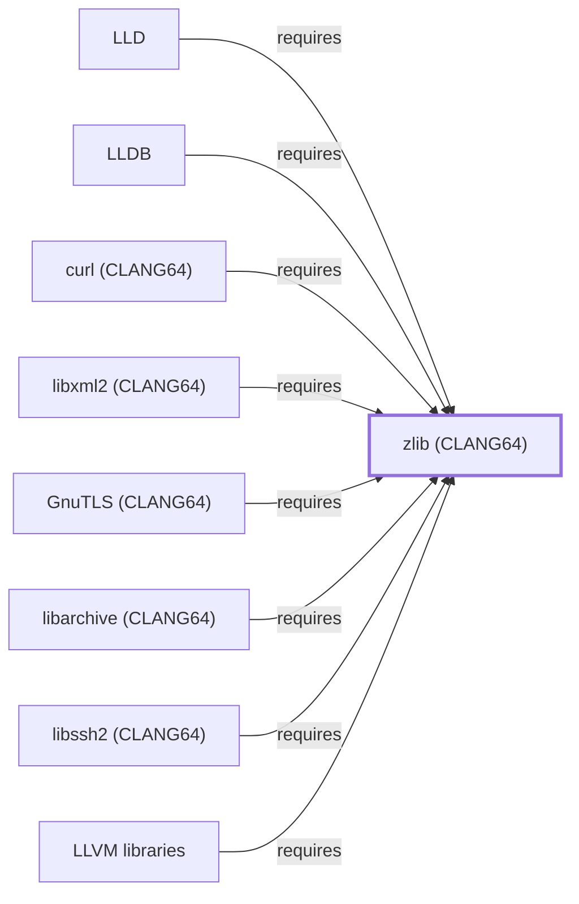

# zlib (CLANG64)

<!-- BEGIN GENERATED object-facts -->

| Model fact | Value |
| --- | --- |
| Object | `library:gnu:zlib@clang64` |
| Kind | `library` |
| Status | `partial` |
| Confidence | `high` |
| Authority | zlib project |
| Environments | `clang64` |
| Upstream | <https://www.zlib.net/> |
| Packaged as | `package:msys2:mingw-w64-clang-x86_64-zlib` |
| Version (observed) | 1.3.2-2 |
| License (observed) | spdx:Zlib |
| Architecture (observed) | any |
| Installed size (observed) | 382.6 KB |

**Evidence on this object**

- `evidence:catalog:current` — MSYS2 pacman package catalog (`observed`, retrieved 2026-07-29)
- `evidence:zlib:manual-2026-07-30` — zlib Manual (`primary`, retrieved 2026-07-30)

Generated from the composed model by `tools/build_object_facts.py`. Observed values come from the catalog snapshot and change when it is refreshed.
Edits between the surrounding markers are overwritten on the next build.

<!-- END GENERATED object-facts -->

## Purpose

This page documents the **CLANG64-environment** zlib package
specifically — the DEFLATE compression library — depended on by
[LLD](LLD.md) and [LLDB](LLDB.md) to back compressed debug-section
support, already cited by package name on
[LLD.md](LLD.md#dependencies) and [LLDB.md](LLDB.md#dependencies) before
this page existed. See the
[official zlib project site](https://www.zlib.net/) for the full
reference.

## Architectural Classification

`library:gnu:zlib@clang64` is packaged in the CLANG64 environment as
`package:msys2:mingw-w64-clang-x86_64-zlib` (version `1.3.2-2` in the
current catalog snapshot) — the same version number as the UCRT64
sibling documented on [zlib (UCRT64)](ZLIB.md), but a separately built,
separate catalog entity. This is the package
[LLD](LLD.md) and [LLDB](LLDB.md) — both CLANG64-native components
themselves — actually depend on, the third distinct zlib-named catalog
entity in this knowledge base alongside
[zlib (UCRT64)](ZLIB.md) and the MSYS `zlib` package cited (but not
separately modeled) on [libcurl's](LIBCURL.md#dependencies) and
[GnuPG's](GNUPG.md#dependencies) own pages.

## Responsibilities

- Providing DEFLATE compression and decompression, consumed by
  [LLD](LLD.md) and [LLDB](LLDB.md) to back reading and writing
  zlib-compressed debug sections.

## Boundaries

This page's package serves CLANG64-environment consumers specifically;
[GCC](GNU-GCC.md), [GNU Binutils](GNU-BINUTILS.md), and
[GDB](GNU-GDB.md) instead link
[zlib (UCRT64)](ZLIB.md#reverse-dependencies) — the two are not
interchangeable, matching the same distinction already made throughout
this volume for MSYS/UCRT64/CLANG64 sibling triples.

## Interfaces

- The zlib C API (`deflate`, `inflate`, and related functions), the
  same interface [zlib (UCRT64)](ZLIB.md#interfaces) documents, per the
  documentation.

## Dependencies

The catalog snapshot records no `runtime-depends-on` edges for
`package:msys2:mingw-w64-clang-x86_64-zlib` beyond standard toolchain
runtime support.

## Reverse Dependencies

**Correction, 2026-07-30**: this page previously stated 285 relationships;
the catalog snapshot actually records **287** targeting
`package:msys2:mingw-w64-clang-x86_64-zlib`. Four are already modeled
in this knowledge base: `package:msys2:mingw-w64-clang-x86_64-lld`
(`relationship:toolchain:lld-requires-zlib-clang64`),
`package:msys2:mingw-w64-clang-x86_64-lldb`
(`relationship:toolchain:lldb-requires-zlib-clang64`),
`package:msys2:mingw-w64-clang-x86_64-llvm-libs`
(`relationship:foundation-libraries:llvm-libs-requires-zlib-clang64`,
correcting [LLVM libraries'](LLVM-LIBS.md) own prior incorrect
no-dependencies claim), and `package:msys2:mingw-w64-clang-x86_64-libxml2`
(`relationship:foundation-libraries:libxml2-clang64-requires-zlib-clang64`,
added 2026-07-30 to close a gap in
[libxml2 (CLANG64)'s own dependency table](LIBXML2-CLANG64.md#dependencies),
which had cited this package by name without a corresponding graph
edge). The remaining ~283 recorded dependents (a broad mix of CLANG64
packages) are not individually modeled in this knowledge base; see the
[reverse dependency impact analysis](REVERSE-DEPENDENCY-IMPACT-ANALYSIS.md)
for the current full list.

## Configuration

zlib has no persistent configuration file; compression level and
parameters are set entirely through its C API by the calling program.

## Initialization and Execution Flow

As a library, zlib has no independent process lifecycle: it initializes
and executes within the process of whatever program links against it —
[LLD](LLD.md) or [LLDB](LLDB.md) in this dependency chain. As a native
MinGW-w64 library, this process model is Windows-facing directly rather
than mediated by `msys-2.0.dll`.

## Runtime Behavior

Identical functional behavior to [zlib (UCRT64)](ZLIB.md); see that
page for detail not specific to the CLANG64/UCRT64 packaging
distinction.

## Compatibility and Variants

The CLANG64 and UCRT64 zlib packages are separately versioned catalog
entities (see Architectural Classification); code built against one is
not automatically compatible with the other without matching the
correct environment.

## Security Considerations

zlib is not itself a security-sensitive component in the usual sense;
decompressing untrusted compressed debug data carries the general trust
considerations of any decompression library. See
[Threat Model and Supply Chain](THREAT-MODEL-AND-SUPPLY-CHAIN.md) for
the project's general supply-chain posture; no version-qualified CVE
review has been performed for the recorded `1.3.2-2` version.

## Failure Modes and Diagnostics

An LLD or LLDB failure reading zlib-compressed debug information should
be checked against the actual compression format of the debug data
before being treated as an LLD or LLDB defect.

## Evidence, Assumptions, and Open Questions

DEFLATE compression scope is backed by the official zlib project site
(`evidence:zlib:manual-2026-07-30`), the same evidence record
[zlib (UCRT64)](ZLIB.md) cites. Package identity, version, and the four
modeled dependent edges are backed by the pacman catalog snapshot
(`evidence:catalog:current`). Open, and explicitly out of scope for
this page: the ~283 remaining recorded dependents not individually
modeled, and header-level API surface / PE import/export-level
evidence, per the
[Library Family Classification](LIBRARY-FAMILY-CLASSIFICATION.md)
methodology.

<!-- BEGIN GENERATED dependency-subgraph -->

## Dependency Diagram

Dependencies and dependents of `library:gnu:zlib@clang64` in the composed graph: 10 dependents and 0 dependencies, of which 2 are omitted here for legibility.

Generated from the composed model by `tools/build_object_diagrams.py`.
Edits between the surrounding markers are overwritten on the next build.

<!-- END GENERATED dependency-subgraph -->

## Related Objects

- [MSYS2 Library Architecture](LIBRARIES-ARCHITECTURE.md)
- [zlib (UCRT64)](ZLIB.md)
- [LLD](LLD.md)
- [LLDB](LLDB.md)
- [LLVM libraries](LLVM-LIBS.md)
- [Zstandard (CLANG64)](LIBZSTD-CLANG64.md)
