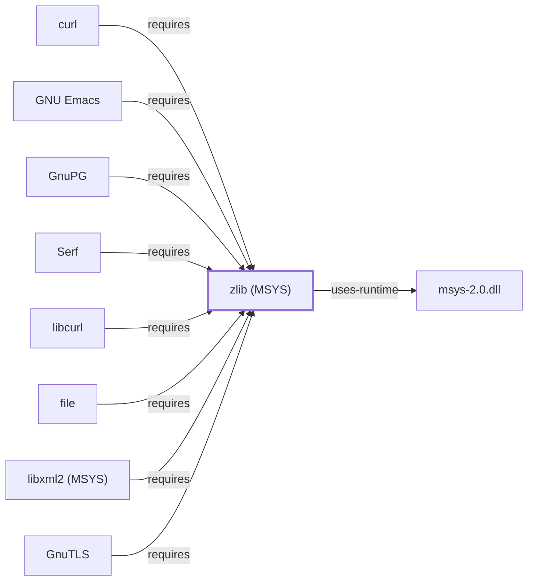

# zlib (MSYS)

## Purpose

This page documents the **MSYS-environment** zlib package specifically
— the DEFLATE compression library — as a correction discovered while
investigating [libfido2's](LIBFIDO2.md) own dependencies:
[LIBFIDO2.md](LIBFIDO2.md#dependencies) had incorrectly identified this
package as this knowledge base's existing UCRT64 zlib entity. With 60
recorded reverse dependents, six of them already documented elsewhere in
this knowledge base — [curl](CURL.md), [GNU Emacs](GNU-EMACS.md),
[GnuPG](GNUPG.md), [libcurl](LIBCURL.md), [libfido2](LIBFIDO2.md), and
[file](FILE.md) — this is one of the largest single-batch additions this
session. See the
[official zlib project site](https://www.zlib.net/) for the full
reference.

## Architectural Classification

`library:gnu:zlib@msys` is packaged in the MSYS environment as
`package:msys2:zlib` (version `1.3.2-1` in the current catalog snapshot)
— a slightly older patch version than the UCRT64 sibling documented on
[zlib (UCRT64)](ZLIB.md) (`1.3.2-2`), and a separately built, separate
catalog entity. This is the package
[curl](CURL.md), [GNU Emacs](GNU-EMACS.md), [GnuPG](GNUPG.md),
[libcurl](LIBCURL.md), [libfido2](LIBFIDO2.md), and
[file](FILE.md) — all MSYS-environment entities themselves — actually
depend on. This is the third distinct zlib-named catalog entity in this
knowledge base, alongside [zlib (UCRT64)](ZLIB.md) and
[zlib (CLANG64)](ZLIB-CLANG64.md).

## Responsibilities

- Providing DEFLATE compression and decompression, consumed by six
  MSYS-environment entities in this knowledge base for purposes ranging
  from HTTP `Content-Encoding` decompression ([curl](CURL.md),
  [libcurl](LIBCURL.md)) to OpenPGP packet compression
  ([GnuPG](GNUPG.md)) to file-type identification inside compressed
  containers ([file](FILE.md)).

## Boundaries

This page's package serves MSYS-environment consumers specifically;
[GCC](GNU-GCC.md), [GNU Binutils](GNU-BINUTILS.md), and
[GDB](GNU-GDB.md) instead link [zlib (UCRT64)](ZLIB.md#reverse-dependencies),
and [LLD](LLD.md)/[LLDB](LLDB.md) link
[zlib (CLANG64)](ZLIB-CLANG64.md#reverse-dependencies) — none of the
three are interchangeable.

## Interfaces

- The zlib C API (`deflate`, `inflate`, and related functions), the
  same interface [zlib (UCRT64)](ZLIB.md#interfaces) documents, per the
  documentation.

## Dependencies

The catalog snapshot records dependencies for `package:msys2:zlib` not
individually enumerated on this page; this page's scope is limited to
confirming and documenting its six modeled dependency relationships.

## Reverse Dependencies

The catalog snapshot records 60 relationships targeting
`package:msys2:zlib` — the widest reverse-dependency fan-in of any
single batch addition this session, tied in spirit with
[GNU libiconv (MSYS)](GNU-LIBICONV-MSYS.md)'s six modeled dependents.
Nine are already modeled in this knowledge base: `package:msys2:curl`
(`relationship:ssh-curl-git:curl-requires-zlib-msys`),
`package:msys2:emacs`
(`relationship:gnu-userland:emacs-requires-zlib-msys`),
`package:msys2:gnupg`
(`relationship:ssh-curl-git:gnupg-requires-zlib-msys`),
`package:msys2:libcurl`
(`relationship:foundation-libraries:libcurl-requires-zlib-msys`),
`package:msys2:libfido2`
(`relationship:foundation-libraries:libfido2-requires-zlib-msys`),
`package:msys2:file`
(`relationship:foundation-libraries:file-requires-zlib-msys`),
`package:msys2:libgnutls`
(`relationship:foundation-libraries:gnutls-msys-requires-zlib-msys`),
`package:msys2:libssh2`
(`relationship:foundation-libraries:libssh2-requires-zlib-msys`), and
`package:msys2:libxml2`
(`relationship:foundation-libraries:libxml2-msys-requires-zlib-msys`).
The remaining ~51 recorded dependents (`binutils` — the separate MSYS
`binutils` package, distinct from the UCRT64 package
[GNU Binutils](GNU-BINUTILS.md) documents — `cmake`, `git-crypt`,
`glib2`, `libarchive`, and many others) are not individually modeled in
this knowledge base; see the
[reverse dependency impact analysis](REVERSE-DEPENDENCY-IMPACT-ANALYSIS.md)
for the current full list.

## Configuration

zlib has no persistent configuration file; compression level and
parameters are set entirely through its C API by the calling program.

## Initialization and Execution Flow

As a library, zlib has no independent process lifecycle: it initializes
and executes within the process of whatever program links against it,
directly or (as with [libcurl](LIBCURL.md)) transitively through
another MSYS library. As an MSYS-dependent library, this is adapted
from POSIX semantics onto Windows process primitives by `msys-2.0.dll`
per [MSYS Runtime Initialization](MSYS-RUNTIME-INITIALIZATION.md).

## Runtime Behavior

Identical functional behavior to [zlib (UCRT64)](ZLIB.md); see that
page for detail not specific to the MSYS/UCRT64/CLANG64 packaging
distinction.

## Compatibility and Variants

The MSYS, UCRT64, and CLANG64 zlib packages are three separately
versioned catalog entities (see Architectural Classification); code
built against one is not automatically compatible with another without
matching the correct environment.

## Security Considerations

zlib is not itself a security-sensitive component in the usual sense;
decompressing untrusted data (an HTTP response body, an OpenPGP packet)
carries the general trust considerations of any decompression library.
See [Threat Model and Supply Chain](THREAT-MODEL-AND-SUPPLY-CHAIN.md) for
the project's general supply-chain posture; no version-qualified CVE
review has been performed for the recorded `1.3.2-1` version.

## Failure Modes and Diagnostics

A decompression failure in any of this package's six modeled dependents
should be checked against the actual compressed data's integrity before
being treated as a defect in the calling program.

## Evidence, Assumptions, and Open Questions

DEFLATE compression scope is backed by the official zlib project site
(`evidence:zlib:manual-2026-07-30`), the same evidence record
[zlib (UCRT64)](ZLIB.md) cites. Package identity, version, and the six
modeled dependent edges are backed by the pacman catalog snapshot
(`evidence:catalog:current`). Open, and explicitly out of scope for
this page: the ~54 remaining recorded dependents not individually
modeled, and header-level API surface / PE import/export-level
evidence, per the
[Library Family Classification](LIBRARY-FAMILY-CLASSIFICATION.md)
methodology.

<!-- BEGIN GENERATED dependency-subgraph -->

## Dependency Diagram

Dependencies and dependents of `library:gnu:zlib@msys` in the composed graph: 11 dependents and 1 dependency, of which 3 are omitted here for legibility.

Generated from the composed model by `tools/build_object_diagrams.py`.
Edits between the surrounding markers are overwritten on the next build.

<!-- END GENERATED dependency-subgraph -->

## Related Objects

- [MSYS2 Library Architecture](LIBRARIES-ARCHITECTURE.md)
- [zlib (UCRT64)](ZLIB.md)
- [zlib (CLANG64)](ZLIB-CLANG64.md)
- [curl](CURL.md)
- [GNU Emacs](GNU-EMACS.md)
- [GnuPG](GNUPG.md)
- [libcurl](LIBCURL.md)
- [libfido2](LIBFIDO2.md)
- [file](FILE.md)
- [libarchive (MSYS)](LIBARCHIVE-MSYS.md)
- [GnuTLS](GNUTLS.md)
- [libssh2](LIBSSH2.md)
- [libxml2 (MSYS)](LIBXML2-MSYS.md)
- [Serf](LIBSERF-MSYS.md)
