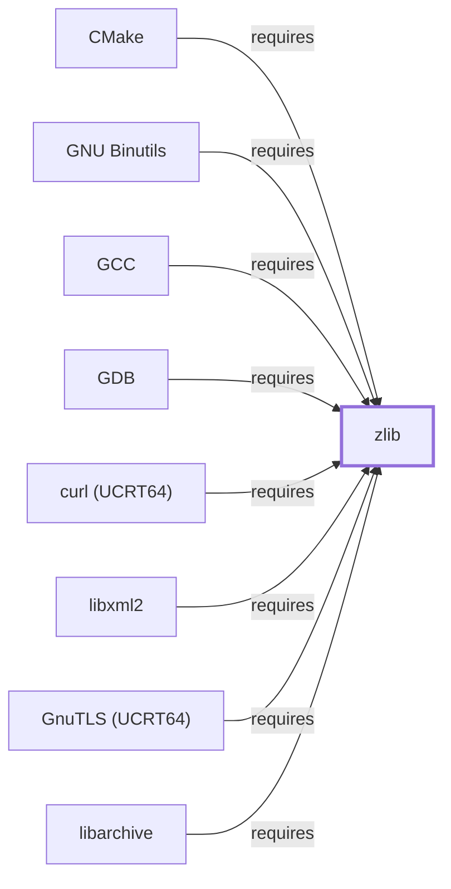

# zlib

<!-- BEGIN GENERATED object-facts -->

| Model fact | Value |
| --- | --- |
| Object | `library:gnu:zlib` |
| Kind | `library` |
| Status | `partial` |
| Confidence | `high` |
| Authority | Jean-loup Gailly and Mark Adler |
| Environments | `ucrt64` |
| Upstream | <https://www.zlib.net/> |
| Packaged as | `package:msys2:mingw-w64-ucrt-x86_64-zlib` |
| Version (observed) | 1.3.2-2 |
| License (observed) | spdx:Zlib |
| Architecture (observed) | any |
| Installed size (observed) | 427.8 KB |

**Evidence on this object**

- `evidence:catalog:current` — MSYS2 pacman package catalog (`observed`, retrieved 2026-07-29)
- `evidence:zlib:manual-2026-07-30` — zlib Manual (`primary`, retrieved 2026-07-30)

**Claims about this object**

- `claim:library:zlib:hub` (`observation`, `verified`) — zlib is the most-depended-upon package observed in this catalog snapshot among all components and libraries modeled in this knowledge base, with 299 recorded reverse dependents, exceeding gcc-libs' 167.

Generated from the composed model by `tools/build_object_facts.py`. Observed values come from the catalog snapshot and change when it is refreshed.
Edits between the surrounding markers are overwritten on the next build.

<!-- END GENERATED object-facts -->

## Purpose

Zlib implements the DEFLATE compression algorithm behind gzip, PKZIP, and
countless other formats and libraries, and — per this snapshot — it is the
single most-depended-upon package in this entire knowledge base. This page
documents its architectural centrality; see the
[official zlib manual](https://www.zlib.net/manual.html) for the API
reference.

## Architectural Classification

`library:gnu:zlib` is packaged per native environment: this page cites the
UCRT64 build, `package:msys2:mingw-w64-ucrt-x86_64-zlib` (version
`1.3.2-2` in the current catalog snapshot, license `Zlib` — the
library's own short, permissive license, distinct from the GPL/LGPL
licensing common elsewhere in this knowledge base), authored by Jean-loup
Gailly and Mark Adler. This page is scoped to Volume 6's
package/dependency-level evidence; the fuller
[Library Family Classification](LIBRARY-FAMILY-CLASSIFICATION.md)
methodology (headers, `pkg-config`/CMake metadata, PE import/export
analysis) has not been applied here and remains open.

## Responsibilities

- Providing the DEFLATE compression/decompression algorithm as a shared
  library, consumed by other libraries and programs rather than used
  standalone from the command line (that role belongs to
  [GNU Gzip](GNU-GZIP.md), a separate, independent implementation of the
  same underlying format).

## Boundaries

Zlib is a library, not a CLI tool; it has no standalone user-facing
interface. It implements only DEFLATE-family compression, distinct from the
Burrows-Wheeler ([bzip2](BZIP2.md)), LZMA2 ([XZ Utils](XZ-UTILS.md)), and
other compression algorithms documented elsewhere in this knowledge base.

## Interfaces

- A C API (`deflate()`/`inflate()` and the higher-level `gzread()`/`gzwrite()`
  family) for in-process compression and decompression, consumed by
  linking, per the manual. This page does not enumerate the header-level
  surface; that belongs to
  [Header and Development-Metadata Indexes](HEADER-AND-METADATA-INDEXES.md).

## Dependencies

The catalog snapshot records no `runtime-depends-on` edges for
`package:msys2:mingw-w64-ucrt-x86_64-zlib` beyond its membership in the
UCRT64 repository and environment — a minimal dependency footprint
consistent with zlib's small, self-contained, widely portable design.

## Reverse Dependencies

The snapshot records **299** relationships targeting
`package:msys2:mingw-w64-ucrt-x86_64-zlib` — the largest reverse-dependency
count recorded anywhere in this knowledge base
(`claim:library:zlib:hub`), exceeding [gcc-libs](LIBSTDCXX.md#reverse-dependencies)'s
167 and far exceeding [ncurses](NCURSES.md#reverse-dependencies)'s 40. This
reflects DEFLATE compression's use as a near-universal building block
across compilers ([GCC](GNU-GCC.md), [Clang](CLANG.md), [LLD](LLD.md)),
build systems ([CMake](CMAKE.md)), network transfer
([curl (UCRT64)](CURL-UCRT64.md)), version control
([Git](GIT-MSYS-PACKAGE.md)), and archive tools
([GNU Tar](GNU-TAR.md)'s optional codec linkage question flagged on that
page) across this environment. See the
[reverse dependency impact analysis](REVERSE-DEPENDENCY-IMPACT-ANALYSIS.md)
for the current full list.

## Configuration

Zlib has no persistent configuration file or environment variables; its
behavior is controlled entirely by the compression-level and
stream-management parameters a calling program passes to its C API.

## Initialization and Execution Flow

As a library, zlib has no independent process lifecycle: it initializes
and executes within the process of whatever program links against it, the
same model documented for [libstdc++](LIBSTDCXX.md#initialization-and-execution-flow)
and [libc++](LIBCXX.md#initialization-and-execution-flow).

## Runtime Behavior

Given 299 recorded dependents, zlib's compression/decompression correctness
and performance are load-bearing for a very large fraction of this
environment's software; this page does not attempt to characterize that
behavior beyond noting its centrality (per Reverse Dependencies above).

## Compatibility and Variants

The DEFLATE format zlib implements is a stable, widely standardized format
(the basis for gzip, PNG, and PKZIP's default compression method); this
page does not document zlib-specific API version compatibility beyond
noting the recorded `1.3.2-2` version.

## Security Considerations

Given its 299 recorded dependents, zlib carries the widest observed blast
radius of any component or library documented in this knowledge base: a
defect here would potentially affect nearly every other tool this
knowledge base has documented, from compilers to version control to
archive tools. This is a risk-concentration observation, not an assertion
of an actual defect. See
[Threat Model and Supply Chain](THREAT-MODEL-AND-SUPPLY-CHAIN.md) for the
project's general supply-chain posture; no version-qualified CVE review has
been performed for the recorded `1.3.2-2` version — a priority candidate
for one, given the dependency count recorded here.

## Failure Modes and Diagnostics

Zlib itself has no user-facing CLI to diagnose directly; compression- or
decompression-related failures in a dependent tool should be triaged
against that tool's own documentation first, since zlib's C API surfaces
errors through return codes a calling program is responsible for handling
and reporting.

## Evidence, Assumptions, and Open Questions

The compression model is backed by the official zlib manual
(`evidence:zlib:manual-2026-07-30`), matching the `project_url` already
recorded for `package:msys2:mingw-w64-ucrt-x86_64-zlib` in the catalog.
Package identity, version, license, and the reverse-dependency count are
backed by the pacman catalog snapshot (`evidence:catalog:current`) via
`claim:library:zlib:hub`. Open, and explicitly out of scope for this page:
header-level API surface and PE import/export-level evidence, per the
[Library Family Classification](LIBRARY-FAMILY-CLASSIFICATION.md)
methodology; no version-qualified CVE review has been performed despite
this library's unusually wide blast radius.

<!-- BEGIN GENERATED dependency-subgraph -->

## Dependency Diagram

Dependencies and dependents of `library:gnu:zlib` in the composed graph: 13 dependents and 0 dependencies, of which 5 are omitted here for legibility.

Generated from the composed model by `tools/build_object_diagrams.py`.
Edits between the surrounding markers are overwritten on the next build.

<!-- END GENERATED dependency-subgraph -->

## Related Objects

- [MSYS2 Library Architecture](LIBRARIES-ARCHITECTURE.md)
- [libstdc++](LIBSTDCXX.md)
- [libc++](LIBCXX.md)
- [GNU Gzip](GNU-GZIP.md)
- [libarchive](LIBARCHIVE.md)
- [CMake](CMAKE.md)
- [curl (UCRT64)](CURL-UCRT64.md)
- [libfido2 (UCRT64)](LIBFIDO2-UCRT64.md)
- [GNU GCC](GNU-GCC.md)
- [GNU Binutils](GNU-BINUTILS.md)
- [GDB](GNU-GDB.md)
- [Zstandard (library)](LIBZSTD.md)
- [zlib (MSYS)](ZLIB-MSYS.md)
- [zlib (CLANG64)](ZLIB-CLANG64.md)
